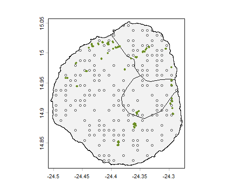
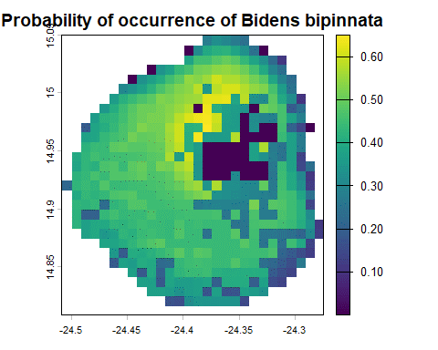

# Species Distribution Modelling with R: Invasive Species on Fogo Island (Cabo Verde)

## 🌿 Project Overview
This project focuses on forecasting the potential distribution of the most dominant introduced plant species on Fogo Island (Cabo Verde). 
Developed during the GeoTraining Summer School 2024 (Frankfurt), the study integrates bioclimatic data with satellite-derived land cover to identify **environmental niches** and **invasion hotspots**.

## 🛠️ Technical Workflow & Methodology
The study employs a rigorous statistical modelling framework (GLM) implemented through a reproducible R pipeline:

1. **Biological & Environmental Data Acquisition**:

    * Biological data: The species occurrence records were collected during a previous project and provided to the participants.

    * Bioclimatic Variables: Dynamically retrieved from the WorldClim database via the geodata API.

    * Land Cover Integration: Utilised a custom land cover layer (prepared via Sentinel-2 classification) to add local-scale ecological constraints.

2. **Spatial Preprocessing**:

    * Alignment: Systematic cropping, masking, and resampling of all environmental layers to a common spatial resolution and extent using the terra package.

3. **Modelling Framework (GLM)**:

    * Sampling Strategy: Generation of pseudo-absence points to complement opportunistic occurrence data.

    * Validation: Splitting data into Training (80%) and Test (20%) sets to ensure model generalizability.

    * Algorithms: Generalised Linear Models (GLM)/Binary Logistic Model utilised to estimate the probability of occurrence based on environmental predictors.

4. **Evaluation & Mapping**:

    * Performance: Thresholding of probability maps to produce binary "suitability" maps.

    * Metrics: Rigorous evaluation using Confusion Matrices, AUC, and Kappa statistics.

    * Prediction: Generation of high-resolution suitability maps for the entire island.

## 🧰 Tech Stack

* Language: R

* Spatial Libraries: terra, geodata

* Modelling Engine: predicts, stats

* Workflow: Modular R scripting for end-to-end reproducibility.

## 📊 Key Results

The model successfully identified temperature seasonality, precipitation and land cover as primary drivers of the species' expansion.
The northern and central regions of Fogo Island were found to be the most suitable, covering both vegetation and settlement areas. 
Conversely, unsuitable areas were identified in the rocky landscape.

## 💾 Data Notes: Bioclimatic Variables (WorldClim)

* Access Protocol: The environmental predictors used in this modelling workflow are sourced from the `WorldClim v2.1` database. 
To maintain a lightweight repository and ensure compliance with data redistribution layers, the raw `.tif` files are not hosted directly.

* Automated Retrieval: The dataset can be programmatically re-acquired using the `geodata` package in R. 
The following parameters were utilised in the tutorial:

* Source: `worldclim_global(var = 'bio', res = 0.5, path = 'data_env/')`

* Resolution: 30 arc-seconds (~ 1 km²)

* Processing: Upon retrieval, the global layers are automatically cropped and masked to  
the Fogo Island extent using the administrative boundaries provided in `gadm_cpv/`.

## 👥 Team & Credits

* Developed as a collaborative project during the GeoTraining 2024.

* Team Lead: SODE A. Idelphonse
* Collaborators: Olajide A.Y., Nakhwala L., Opara A., Opoku M., Barasa C.W.
